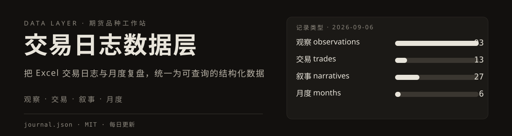

# 期货交易日志数据

个人期货交易复盘的私有数据仓。数据由 [EvanYFM/trading-system](https://github.com/EvanYFM/trading-system) 的脚本生产并推送到本仓，供公开工作站 [EvanYFM/futures-workstation](https://github.com/EvanYFM/futures-workstation) 读取展示。

  

## 数据结构（journal.json）

| 字段 | 内容 |
|---|---|
| `observations` | 盘面 / 席位观察记录 |
| `trades` | 交易记录 |
| `narratives` | 阶段性叙事与复盘 |
| `months` | 月度汇总 |
| `updatedAt` | 最后更新时间 |

## 相关仓库

- 源码与数据生产：[trading-system](https://github.com/EvanYFM/trading-system)（私有）
- 展示端：[futures-workstation](https://github.com/EvanYFM/futures-workstation)（公开，GitHub Pages）
